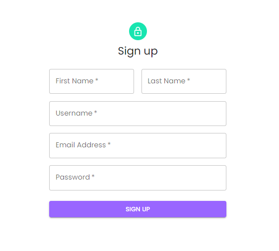
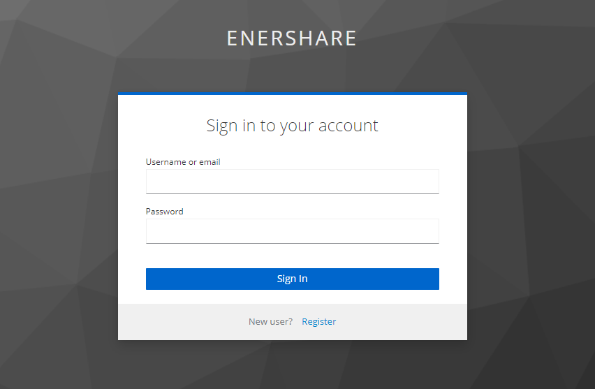
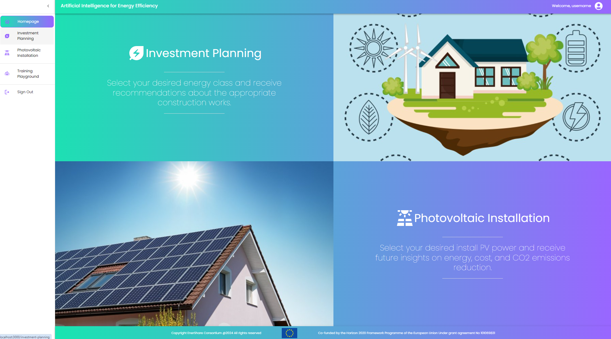
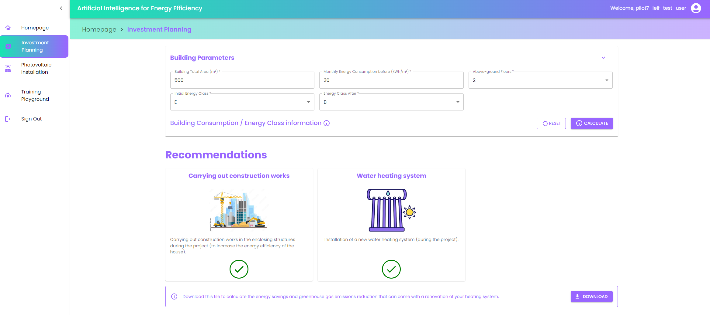
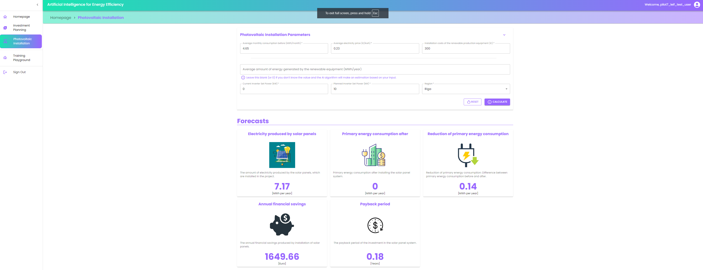

This is the documentation page of the **AI4EF** user interface. An analytical description of all the available
functionalities is provided, along with representative screenshots of the actual implementation.

The **AI4EF** runs by default on port 3000. However, this can be modified by the user.

This interface allows users to optimize their investment planning by selecting a desired energy class and receiving
tailored recommendations for appropriate construction works. Additionally, users can explore the benefits of
photovoltaic installation by selecting their preferred PV power capacity to gain insights into future energy savings,
cost reductions, and the potential decrease in CO2 emissions.

This front-end has been developed using [React](https://react.dev/), a popular JavaScript library for building user
interfaces. React enables efficient and dynamic rendering of components, making the application highly responsive and
interactive. For the styling and layout, we utilized the [MUI](https://mui.com/) library, which provides a
comprehensive set of customizable and pre-designed components based on Google's Material Design principles. This ensures
that the user interface is both visually appealing and consistent across devices while maintaining ease of use.

A more detailed description follows.

# User Interface (UI) Functionalities

## Sign-Up page

The Sign Up page requires users to input their **First Name**, **Last Name**, **Username**, **Email Address**, and **Password**. 
Once all required fields are filled in, users can click the **SIGN UP** button to create their account.

## Sign-In page

This front-end application is fully integrated with **EnerShare's Security Framework**, which is based on **Keycloak**,
an open-source identity and access management solution. Thus, upon trying to access the platform without being
logged-in, it automatically navigates the users to the common sign-in page (as illustrated below) created for the needs
of the project.

## Homepage

The Homepage displays the main capabilities of the dashboard in head titles, as illustrated below:

## Investment Planning

This interface is designed to allow users to input key parameters related to building energy consumption and class
upgrades. The user is required to provide the following details:

1. **Building Total Area (m²):** Enter the total surface area of the building in square meters.
2. **Monthly Energy Consumption Before (kWh/m²):** Input the building’s energy consumption before any upgrades, measured
   in kilowatt-hours per square meter.
3. **Above-ground Floors:** Select the number of floors above ground level in the building.
4. **Initial Energy Class:** Choose the building’s current energy efficiency class.
5. **Energy Class After:** Select the target energy efficiency class after planned improvements.

Additionally, pressing the "info" icon next to the "Building Consumption / Energy Class information" heading, a table
appears as a modal window, providing users with a detailed guide to identify their building's energy class based on
heating consumption. The table categorizes energy efficiency classes (A to F) according to different heating area
ranges (50m² to 120m², 120m² to 250m², and over 250m²), and specifies the corresponding energy consumption thresholds (
measured in kWh/m²). This allows users to determine their building’s energy class based on its specific consumption
metrics.

Once all the fields are completed, users can click the **CALCULATE** button to receive an analysis of energy consumption
and energy class changes. They also have the option to reset all inputs using the **RESET** button.

The output of the service is a number of recommendations to achieve the envisioned target, based on the user's input.
Finally, the users are given the possibility to download an Excel file that can help them calculate the energy savings
and greenhouse gas emissions reduction that can come with a renovation of their heating system.

## Photovoltaic Installation

This interface allows users to input key parameters for photovoltaic (PV) installation planning. The user needs to
provide the following information:

1. **Average Monthly Consumption Before (kWh):** Enter the building's energy consumption before the installation of PV
   equipment.
2. **Average Electricity Price (€/kWh):** Input the current price of electricity per kilowatt-hour.
3. **Installation Costs of the Renewable Production Equipment (€):** Specify the installation costs for the renewable
   energy equipment.
4. **Average Amount of Energy Generated by the Renewable Equipment (MWh/year):** Optionally, input the expected energy
   generation from the renewable system in megawatt-hours per year (leave blank or enter 0 to let the AI make an
   estimation).
5. **Current Inverter Set Power (kW):** Enter the current power capacity of the inverter system in kilowatts.
6. **Planned Inverter Set Power (kW):** Provide the planned power capacity for the new or upgraded inverter system in
   kilowatts.
7. **Region:** Select the region where the PV installation will be located.

Once these fields are completed, the user can press the **CALCULATE** button to obtain insights on energy savings,
costs, and CO₂ reductions. The **RESET** button allows the user to clear the inputs and start over.

## Training Playground

The corresponding menu button is an external link for the AI4EF Dagster instance. AI4EF Training Playground is designed
specifically for users, such as data scientists, seeking an intuitive user interface to orchestrate and execute their
machine learning pipelines. This service includes a default pipeline for creating models suitable for integration with
the AI4EF model-app. It enables data scientists to build and refine custom models tailored to specific use cases,
ensuring seamless integration with the model-app to deliver reliable forecasts for diverse applications. Users can
access the Dagster UI and choose their preferred run, configuring the parameters of their pipeline through the built-in
launchpad menu.

# Other
For deployment instructions, please refer to the [README.md](https://gitlab.epu.ntua.gr/enershare/leif_uc_dashboard/-/blob/main/README.md?ref_type=heads) file of the project.  
For any other inquiries, please contact: [enershare@epu.ntua.gr](mailto:enershare@epu.ntua.gr).
